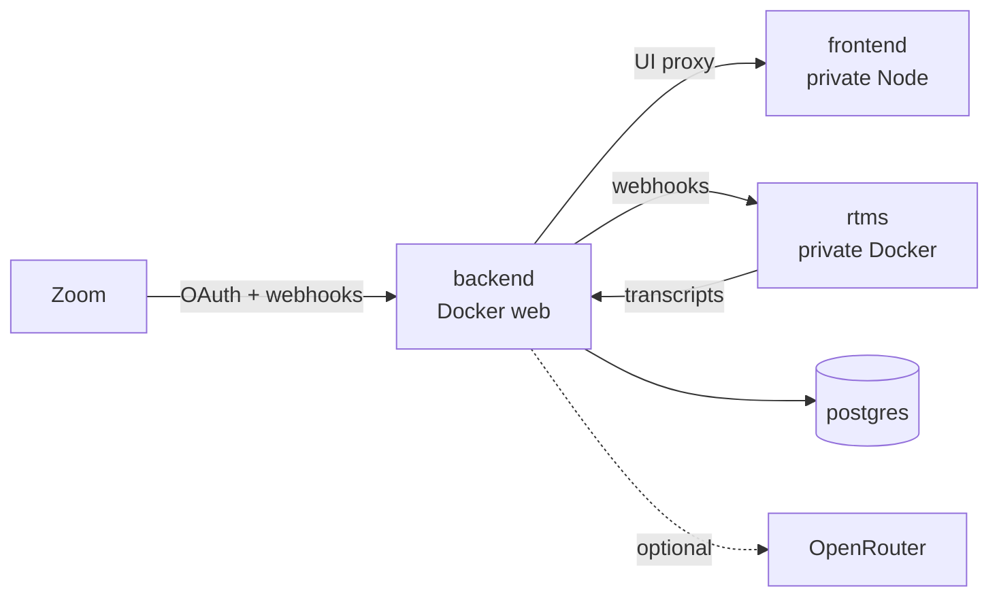

<div align="center">

# Arlo on Render

Deploy **Arlo**, Zoom Developer Relations' Zoom App for live RTMS transcripts and AI summaries, on Render: public API, private Zoom App UI, RTMS worker, and managed Postgres.

<p>
  <a href="https://render.com/deploy-template/api/github/start?template_repo=arlo-render-template">
    
  </a>
</p>

<p>
  <a href="https://render.com">
    
  </a>
  <a href="https://github.com/zoom/arlo">
    
  </a>
  <a href="https://developers.zoom.us/docs/rtms/">
    
  </a>
  <a href="https://nodejs.org/">
    
  </a>
</p>

</div>


## What This Template Shows

This repo packages [zoom/arlo](https://github.com/zoom/arlo) as a one-click Render Blueprint (hybrid docker-fork): Docker for the public API and RTMS worker, native Node for the CRA frontend, plus managed Postgres.

| Piece | Role |
| --- | --- |
| **[Arlo](https://github.com/zoom/arlo)** | Zoom App: live captions, AI summaries, action items (no meeting bot) |
| **[Render Web Service](https://render.com/docs/web-services)** | Public `backend` (Docker Express): OAuth, webhooks, WebSockets, UI proxy, Prisma |
| **[Render Private Services](https://render.com/docs/private-services)** | `frontend` (Node CRA + `serve`) and `rtms` (Docker Zoom RTMS SDK) |
| **[Render Postgres](https://render.com/docs/postgresql)** | Meetings, transcripts, encrypted Zoom tokens |
| **[Zoom RTMS](https://developers.zoom.us/docs/rtms/)** | Live transcript stream into the meeting |
| **[OpenRouter](https://openrouter.ai/)** | Default AI path (free models work without a key) |

You need [Zoom RTMS access](https://developers.zoom.us/docs/rtms/getting-started/) for live captions (approval can take a few days). Without it the stack still deploys; transcripts will not stream. For upstream local setup, see [zoom/arlo](https://github.com/zoom/arlo).

## Architecture



### How It Works

1. Click **Deploy to Render**. Render forks this template into your GitHub account and applies [`render.yaml`](./render.yaml).
2. Enter Zoom Marketplace credentials on Apply (`ZOOM_CLIENT_ID`, `ZOOM_CLIENT_SECRET`, `ZOOM_WEBHOOK_TOKEN`).
3. Render starts `backend` (public), `frontend` and `rtms` (private network), and `postgres`. `backend` runs `npm run db:deploy` before start.
4. Point the Zoom app at the `backend` hostname (OAuth, Home URL, webhook endpoint).
5. Join a meeting, open Arlo, **Start Arlo**, and confirm live transcripts plus AI summaries.

| Resource | Type | Plan | Notes |
| --- | --- | --- | --- |
| `backend` | Web (`runtime: docker`) | **starter** | Health check `/health`; proxies UI; only public hostname |
| `frontend` | Private (`runtime: node`) | **starter** | CRA build + `serve`; reached via `FRONTEND_URL` |
| `rtms` | Private (`runtime: docker`) | **starter** | Zoom RTMS native SDK; inherits Zoom creds from `backend` |
| `postgres` | Postgres 15 | **basic-256mb** | DB `meeting_assistant`; `ipAllowList: []` (private) |

Default region: **oregon**. Keep every resource in the same region. Previews are off. `backend` serves `/api/auth/*`, `/api/rtms/webhook`, `/ws`, and proxies the UI. Do not set `PUBLIC_URL` on Render unless TLS terminates elsewhere; the app uses injected `*_EXTERNAL_URL`.

## Quick Start

### Prerequisites

- A [Render account](https://dashboard.render.com/register?utm_source=github&utm_medium=referral&utm_campaign=ojus_demos&utm_content=readme_link)
- A [Zoom Marketplace](https://marketplace.zoom.us/) General App (Client ID, Client Secret, Event Subscription Secret Token)
- [Zoom RTMS access](https://developers.zoom.us/docs/rtms/getting-started/) for live captions
- Optional: [OpenRouter](https://openrouter.ai/keys) for higher AI rate limits

### Deploy

1. Create a Zoom **General App**. Scopes: `meeting:read`, `user:read`. Enable Zoom App SDK APIs and **RTMS → Transcripts**. Create an Event Subscription and copy the Secret Token.
2. Click **Deploy to Render** above and fork into your GitHub account. Enter the three Zoom secrets on Apply.
3. Wait until services are **Live** (~8–15 minutes first time).
4. Open the `backend` URL; `/health` should return JSON with `"status":"ok"`.
5. Point Zoom at that hostname (no trailing slash), then join a meeting and **Start Arlo**.

| Zoom setting | Value |
| --- | --- |
| OAuth Redirect URL | `https://YOUR_BACKEND/api/auth/callback` |
| OAuth Allow List / Home URL / Domain Allow List | `https://YOUR_BACKEND` |
| Event notification endpoint | `https://YOUR_BACKEND/api/rtms/webhook` |
| Events | `meeting.rtms_started`, `meeting.rtms_stopped` |

Health check:

```bash
curl -sS https://<your-backend>.onrender.com/health
```

## Features

| Feature | Description |
| --- | --- |
| **One-click Blueprint** | Web + two private services + Postgres via `projects` / `environments` |
| **Hybrid runtimes** | Docker for `backend` / `rtms`; native Node 20 for `frontend` |
| **Private network** | Only `backend` is public; UI and RTMS stay internal |
| **Managed Postgres** | Meetings, transcripts, and encrypted Zoom tokens |
| **Generated secrets** | `SESSION_SECRET` and `TOKEN_ENCRYPTION_KEY` created on first deploy |
| **Optional OpenRouter** | Free models work without a key; set a key for higher limits |

## Configuration

| Variable | Source | Description |
| --- | --- | --- |
| `ZOOM_CLIENT_ID` | Required (`sync: false`) | Marketplace → App Credentials |
| `ZOOM_CLIENT_SECRET` | Required (`sync: false`) | Same page |
| `ZOOM_WEBHOOK_TOKEN` | Required (`sync: false`) | Event Subscriptions → Secret Token (not the Client Secret) |
| `SESSION_SECRET` | Auto-generated | Express session secret |
| `TOKEN_ENCRYPTION_KEY` | Auto-generated | AES key for stored Zoom tokens |
| `DATABASE_URL` | Wired | From `postgres` connection string |
| `FRONTEND_URL` | Wired | From `frontend` `hostport` (UI proxy) |
| `RTMS_HOST` / `RTMS_PORT` | Wired | From `rtms` private service |
| `ZOOM_*` on `rtms` | Wired | Copied from `backend` env |
| `BACKEND_HOST` / `BACKEND_PORT` | Wired | So `rtms` can call `backend` |
| `NODE_ENV` | Wired | `production` on `backend` |
| `AI_ENABLED` | Wired | `true` so summaries/chat are on (app defaults off without this) |
| `NODE_VERSION` | Wired | `20` on `frontend` |
| `NODE_OPTIONS` | Wired | `--max-old-space-size=384` on `frontend` |
| `GENERATE_SOURCEMAP` | Wired | `false` on `frontend` (keeps CRA builds smaller) |
| `OPENROUTER_API_KEY` | Optional (`sync: false`) | Leave blank for free models |

Optional knobs (`DEFAULT_MODEL`, `ZOOM_HOST`, `REDIS_URL`, …): [`.env.example`](./.env.example).

## Cost

| Resource | Approx. monthly |
| --- | ---: |
| `backend` (Starter) | ~$7 |
| `frontend` (Starter) | ~$7 |
| `rtms` (Starter) | ~$7 |
| Postgres (`basic-256mb`) | ~$6 |
| **Total** | **~$27** |

Zoom RTMS and OpenRouter usage are billed separately by those providers. Keep all four resources in one region.

## Troubleshooting

| Problem | Solution |
| --- | --- |
| `rtms` Docker build / `@zoom/rtms` link fails | Keep Trixie `libstdc++` in `rtms/Dockerfile`. Do not run `rtms` on native Node. Clear build cache → Redeploy. |
| `backend` health fails / no open ports | Missing Zoom env (process exits before bind). Confirm `dockerCommand` is `npm start`. Confirm Postgres is Live. |
| Forever “starting up” page | Check `frontend` logs; confirm `FRONTEND_URL` wiring. |
| OAuth redirect mismatch | Redirect must equal `https://YOUR_BACKEND/api/auth/callback`. |
| Webhooks 401/403 | `ZOOM_WEBHOOK_TOKEN` must be the Event Subscription Secret Token. |
| AI 429 | Set `OPENROUTER_API_KEY` or change model. |

More: [zoom/arlo troubleshooting](https://github.com/zoom/arlo/blob/main/docs/TROUBLESHOOTING.md).

## Project Structure

```
render.yaml              Render Blueprint (web + pservs + Postgres)
README.md                This file
LICENSE                  MIT (template wrapper)
.env.example             Optional / local overrides
assets/                  Hero / logo
backend/                 Public Docker API + Prisma
frontend/                Private CRA Zoom App UI (native Node on Render)
rtms/                    Private Docker RTMS worker
zoom-app-manifest.json   Optional Zoom Marketplace manifest reference
```

## Learn More

**Render:**
- [Web Services](https://render.com/docs/web-services)
- [Private Services](https://render.com/docs/private-services)
- [PostgreSQL](https://render.com/docs/postgresql)
- [Blueprints](https://render.com/docs/infrastructure-as-code)
- [Deploy to Render button](https://render.com/docs/deploy-to-render-button)

**Arlo / Zoom:**
- [Upstream repo](https://github.com/zoom/arlo)
- [Zoom RTMS docs](https://developers.zoom.us/docs/rtms/)
- [RTMS getting started](https://developers.zoom.us/docs/rtms/getting-started/)
- [Troubleshooting](https://github.com/zoom/arlo/blob/main/docs/TROUBLESHOOTING.md)

## License

[MIT](LICENSE) for this template package.

Upstream [Arlo](https://github.com/zoom/arlo) is MIT. Star that repo if this helped.
