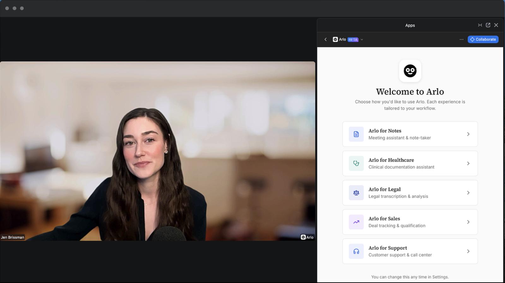
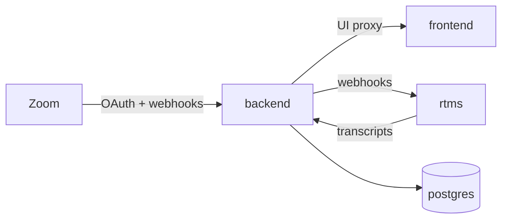

<h1 align="center">Arlo</h1>

  Zoom Apps meeting assistant with live RTMS transcripts and AI summaries. 
  No meeting bot. One Blueprint: public API, private Zoom App UI, RTMS service, Postgres.

  

  
  
  

## What it does

[Arlo](https://github.com/zoom/arlo) is Zoom Developer Relations’ open-source Zoom App for real-time meeting intelligence. Open it in a meeting, start transcription, get live captions plus AI summaries and action items. Captions come from Zoom RTMS, not a bot in the call.

This repo is the Render-hosted package. Upstream local setup still uses docker-compose and ngrok: [zoom/arlo](https://github.com/zoom/arlo).

You need [Zoom RTMS access](https://developers.zoom.us/docs/rtms/getting-started/) for live captions (approval can take a few days). Without it the stack still deploys; transcripts will not stream.

## Stack

| Platform | Job |
|---|---|
| **[Render Web Services](https://render.com/docs/web-services)** | Public `backend` (Docker Express): OAuth, webhooks, WebSockets, UI proxy, Prisma |
| **[Render Private Services](https://render.com/docs/private-services)** | `frontend` (Node CRA + `serve`) and `rtms` (Docker Zoom RTMS SDK) |
| **[Render Postgres](https://render.com/docs/postgresql)** | Meetings, transcripts, encrypted Zoom tokens |
| **[Zoom RTMS](https://developers.zoom.us/docs/rtms/)** | Live transcript stream |
| **[OpenRouter](https://openrouter.ai/)** | Default AI path (free models work without a key) |

## Architecture

| Resource | Type | Plan |
|---|---|---|
| `backend` | Web (Docker) | starter |
| `frontend` | Private (Node 20) | starter |
| `rtms` | Private (Docker) | starter |
| `postgres` | Postgres 15 | basic-256mb |

Region defaults to **oregon**. Keep every resource in the same region. Previews are off. Approx. **~$27/mo** on these plans.

`backend` is the only public hostname (Zoom Home URL). It serves `/api/auth/*`, `/api/rtms/webhook`, `/ws`, and proxies the UI to `frontend`. `rtms` stays private and inherits Zoom credentials from `backend`.

## Prerequisites

| Account | Why |
|---|---|
| [Render](https://dashboard.render.com/register?utm_source=github&utm_medium=referral&utm_campaign=ojus_demos&utm_content=readme_link) | Hosts the four resources |
| [Zoom Marketplace](https://marketplace.zoom.us/) General App | Client ID, Client Secret, webhook Secret Token |
| [Zoom RTMS access](https://developers.zoom.us/docs/rtms/getting-started/) | Live captions |
| [OpenRouter](https://openrouter.ai/keys) (optional) | Higher AI rate limits |

## Configuration

| Variable | Where | Description |
|---|---|---|
| `ZOOM_CLIENT_ID` | `backend` | Marketplace → App Credentials |
| `ZOOM_CLIENT_SECRET` | `backend` | Same page |
| `ZOOM_WEBHOOK_TOKEN` | `backend` | Event Subscriptions → Secret Token (not the Client Secret) |
| `SESSION_SECRET` | `backend` | Auto-generated |
| `TOKEN_ENCRYPTION_KEY` | `backend` | Auto-generated |
| `DATABASE_URL` | `backend` | From `postgres` |
| `FRONTEND_URL` | `backend` | From `frontend.hostport` |
| `RTMS_HOST` / `RTMS_PORT` | `backend` | From `rtms` |
| `ZOOM_*` / `BACKEND_*` | `rtms` | From `backend` |
| `OPENROUTER_API_KEY` | `backend` (optional) | Leave blank for free models |

Optional knobs (`DEFAULT_MODEL`, `ZOOM_HOST`, `REDIS_URL`, …): [`.env.example`](./.env.example).

## Deploy

1. Create a Zoom **General App**. Scopes: `meeting:read`, `user:read`. Enable Zoom App SDK APIs and **RTMS → Transcripts**. Create an Event Subscription and copy the Secret Token.
2. Click **Deploy to Render**. Enter the three Zoom secrets on Apply.
3. Wait for Live (~8–15 min first time). Open the `backend` URL; `/health` should return `{"status":"ok",...}`.
4. Point Zoom at that hostname (no trailing slash):

| Zoom setting | Value |
|---|---|
| OAuth Redirect URL | `https://YOUR_BACKEND/api/auth/callback` |
| OAuth Allow List / Home URL / Domain Allow List | `https://YOUR_BACKEND` |
| Event notification endpoint | `https://YOUR_BACKEND/api/rtms/webhook` |
| Events | `meeting.rtms_started`, `meeting.rtms_stopped` |

5. Join a meeting, open the app, **Start Arlo**, speak, confirm the Transcript tab.

Do not set `PUBLIC_URL` on Render unless TLS terminates elsewhere; the app uses injected `*_EXTERNAL_URL`.

## Troubleshooting

| Symptom | Fix |
|---|---|
| `rtms` Docker build / `@zoom/rtms` link fails | Keep Trixie `libstdc++` in `rtms/Dockerfile`. Do not run `rtms` on native Node. Clear build cache → Redeploy. |
| `backend` health fails / “No open ports” | Missing Zoom env (exits before bind). Confirm `dockerCommand` is `npm start`. Confirm Postgres is Live. |
| Forever “starting up” page | Check `frontend` logs; confirm `FRONTEND_URL` wiring. |
| OAuth redirect mismatch | Redirect must equal `https://YOUR_BACKEND/api/auth/callback`. |
| Webhooks 401/403 | `ZOOM_WEBHOOK_TOKEN` must be the Event Subscription Secret Token. |
| AI 429 | Set `OPENROUTER_API_KEY` or change model. |

More: [zoom/arlo troubleshooting](https://github.com/zoom/arlo/blob/main/docs/TROUBLESHOOTING.md)

## License

MIT
