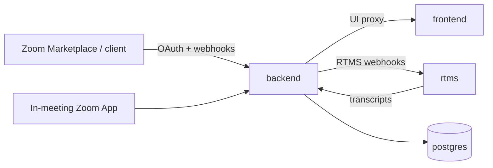

# Arlo on Render

  Zoom Apps meeting assistant with live RTMS transcripts and AI summaries. 
  No meeting bot. Deploy the API, private Zoom App UI, RTMS service, and Postgres in one Blueprint.

  

  
  
  

**At a glance:** ~$27/mo (Oregon Starter ×3 + basic-256mb Postgres) · first deploy ~8–15 min · [Zoom RTMS access](https://developers.zoom.us/docs/rtms/getting-started/) required · OpenRouter free models work without a key

New to Render? [Sign up](https://dashboard.render.com/register?utm_source=github&utm_medium=referral&utm_campaign=ojus_demos&utm_content=hero_cta) first, then use the Deploy button.

Upstream product docs (voice commands, verticals, local docker-compose): [README.UPSTREAM.md](./README.UPSTREAM.md).

## What it does

[Arlo](https://github.com/zoom/arlo) is Zoom Developer Relations’ open-source Zoom App reference for real-time meeting intelligence. You open it inside a meeting, start transcription, and get live captions plus AI summaries and action items. Captions come from Zoom RTMS, not a bot participant.

This template is the hosted path. Local upstream still uses docker-compose + ngrok. Here Render supplies TLS, managed Postgres, and private networking between services.

## Stack

| Platform | Job |
|---|---|
| **[Render Web Services](https://render.com/docs/web-services)** | Public `backend` (Docker Express): OAuth, webhooks, WebSockets, UI proxy, Prisma |
| **[Render Private Services](https://render.com/docs/private-services)** | `frontend` (Node CRA + `serve`) and `rtms` (Docker Zoom RTMS SDK) |
| **[Render Postgres](https://render.com/docs/postgresql)** | Meetings, transcripts, encrypted Zoom tokens |
| **[Zoom RTMS](https://developers.zoom.us/docs/rtms/)** | Live transcript stream into the Zoom App |
| **[OpenRouter](https://openrouter.ai/)** | Default AI path (free models work without a key) |

## Architecture

| Resource | Type | Plan | Role |
|---|---|---|---|
| `backend` | Web (Docker) | starter | Express API + Zoom surface |
| `frontend` | Private (Node 20) | starter | CRA production build |
| `rtms` | Private (Docker) | starter | RTMS SDK ingestion |
| `postgres` | Postgres 15 | basic-256mb | App data |

Blueprint project name: `arlo-render-template`. Region: **oregon** (keep every resource in the same region). Previews off.

The **`backend`** hostname is what Zoom loads as Home URL. It owns `/api/auth/*`, `/api/rtms/webhook`, `/ws`, and proxies other browser routes to `frontend`. `rtms` stays private and inherits Zoom credentials from `backend`.

## Prerequisites

| Account | Why |
|---|---|
| [Render](https://dashboard.render.com/register?utm_source=github&utm_medium=referral&utm_campaign=ojus_demos&utm_content=readme_link) | Hosts the four resources above |
| [Zoom Marketplace](https://marketplace.zoom.us/) General App | Client ID / Secret + webhook Secret Token |
| [Zoom RTMS access](https://developers.zoom.us/docs/rtms/getting-started/) | Required for live captions (approval can take a few days) |
| [OpenRouter](https://openrouter.ai/keys) (optional) | Higher AI rate limits; free models work without a key |

## Configuration

| Variable | Where | Description |
|---|---|---|
| `ZOOM_CLIENT_ID` | `backend` (`sync: false`) | Marketplace → App Credentials |
| `ZOOM_CLIENT_SECRET` | `backend` (`sync: false`) | Same page |
| `ZOOM_WEBHOOK_TOKEN` | `backend` (`sync: false`) | Event Subscriptions → **Secret Token** (not the Client Secret) |
| `SESSION_SECRET` | `backend` | Auto-generated |
| `TOKEN_ENCRYPTION_KEY` | `backend` | Auto-generated (AES for Zoom tokens at rest) |
| `DATABASE_URL` | `backend` | Wired from `postgres` |
| `FRONTEND_URL` | `backend` | Wired from `frontend.hostport` |
| `RTMS_HOST` / `RTMS_PORT` | `backend` | Wired from `rtms`; composed into `RTMS_SERVICE_URL` |
| `ZOOM_*` / `BACKEND_*` | `rtms` | Copied / composed from `backend` |
| `OPENROUTER_API_KEY` | `backend` (optional) | Leave blank for free models (~10 req/min) |
| `DEFAULT_MODEL` | optional | Default `google/gemini-2.0-flash-thinking-exp:free` |
| `FALLBACK_MODEL` | optional | Default `meta-llama/llama-3.2-3b-instruct:free` |
| `ZOOM_HOST` | optional | `zoomgov.com` for Zoom for Government |
| `REDIS_URL` | optional | Required before scaling `backend` past one instance |
| `LOG_LEVEL` | optional | Prefer `info`; `debug` can log request bodies |

Full list: [`.env.example`](./.env.example). Rotating `TOKEN_ENCRYPTION_KEY` invalidates stored Zoom tokens (users must re-authorize).

## Deploy

1. Create a Zoom **General App**. Add scopes `meeting:read` and `user:read`. Enable Zoom App SDK APIs and **RTMS → Transcripts**. Create an Event Subscription and copy the Secret Token.
2. Click **Deploy to Render** (forks into your GitHub account). On Apply, enter the three Zoom secrets. Leave `OPENROUTER_API_KEY` blank unless you want a key.
3. Wait for **Live** (~8–15 min first time). Open the **`backend`** URL and confirm `/health` returns `{"status":"ok",...}`.
4. In Marketplace, point every Zoom URL at that backend hostname (no trailing slash):

| Zoom setting | Value |
|---|---|
| OAuth Redirect URL | `https://YOUR_BACKEND/api/auth/callback` |
| OAuth Allow List / Home URL / Domain Allow List | `https://YOUR_BACKEND` |
| Event notification endpoint | `https://YOUR_BACKEND/api/rtms/webhook` |
| Events | `meeting.rtms_started`, `meeting.rtms_stopped` |

You usually do not set `PUBLIC_URL` on Render; the app accepts injected `*_EXTERNAL_URL`.

5. Join a Zoom meeting, open the app, **Start Arlo**, speak, and watch the Transcript tab.

Optional: start from [`zoom-app-manifest.json`](./zoom-app-manifest.json), then replace URLs with your hostname.

## Customize

- **Pull upstream:** `git remote add upstream https://github.com/zoom/arlo.git && git fetch upstream && git merge upstream/main`. Keep the `projects:` / `environments:` wrapper and `previews.generation: off`. Re-validate with `render blueprints validate` after `render.yaml` conflicts. Packaging pin: Arlo `0.9.0` in `package.json`.
- **Custom domain:** attach on `backend`, then update every Marketplace URL.
- **Persist VTT files:** disk on `/app/storage` + `VTT_STORAGE_PATH`, or `S3_*` from `.env.example` (filesystem is ephemeral otherwise).
- **Scale WebSockets:** add Render Key Value and set `REDIS_URL` before running more than one `backend` instance.
- **Region:** same `region` on all four resources.

## Troubleshooting

| Symptom | Fix |
|---|---|
| `rtms` Docker build / `@zoom/rtms` link fails | Keep the Trixie `libstdc++` install in `rtms/Dockerfile`. Do not switch `rtms` to native Node. Clear build cache → Redeploy. |
| `backend` health check fails / “No open ports detected” | Missing Zoom env or placeholders (process exits before bind). Confirm `dockerCommand` is `npm start` (Dockerfile `CMD` is `npm run dev`). Confirm Postgres is Live and `preDeployCommand` ran. Bump to Standard on OOM. |
| Forever “starting up” page | `frontend` failed to build/start, or `FRONTEND_URL` wiring is wrong. Check `frontend` logs for `serve` on `$PORT`. |
| OAuth redirect mismatch | Redirect must exactly equal `https://YOUR_BACKEND/api/auth/callback`. |
| Webhooks 401/403, no transcripts | `ZOOM_WEBHOOK_TOKEN` must be the Event Subscription Secret Token, not the Client Secret. |
| AI 429 / summary errors | Set `OPENROUTER_API_KEY`, or change model in Settings / `DEFAULT_MODEL`. |

More: [docs/TROUBLESHOOTING.md](./docs/TROUBLESHOOTING.md) · [zoom/arlo issues](https://github.com/zoom/arlo/issues)

## Limits

- Reference implementation: in-memory PKCE, single-instance WebSockets without Redis, basic retries, synchronous webhooks.
- Without RTMS approval you can deploy infrastructure but captions will not stream.
- Healthcare vertical is demo UX, not a clinical system of record. Real PHI needs your compliance program (and a HIPAA-enabled Render workspace if you host PHI there).
- Free Render plans sleep / expire; always-on Starter (or higher) is the practical floor for Zoom webhooks.

This gallery template differs from upstream’s Deploy button: upstream uses `?repo=` against `zoom/arlo`; this uses `?template_repo=` so Render forks into your account first.

## License

Upstream [zoom/arlo](https://github.com/zoom/arlo) and this template: [MIT](./LICENSE).

Architecture / spec reading: [docs/ARCHITECTURE.md](./docs/ARCHITECTURE.md) · [SPEC.md](./SPEC.md) · [Zoom RTMS](https://developers.zoom.us/docs/rtms/)

  
  &nbsp;·&nbsp;
  <a href="https://dashboard.render.com/register?utm_source=github&utm_medium=referral&utm_campaign=ojus_demos&utm_content=footer_link">Sign up on Render</a>
  &nbsp;·&nbsp;
  <a href="https://github.com/zoom/arlo">Upstream</a>

